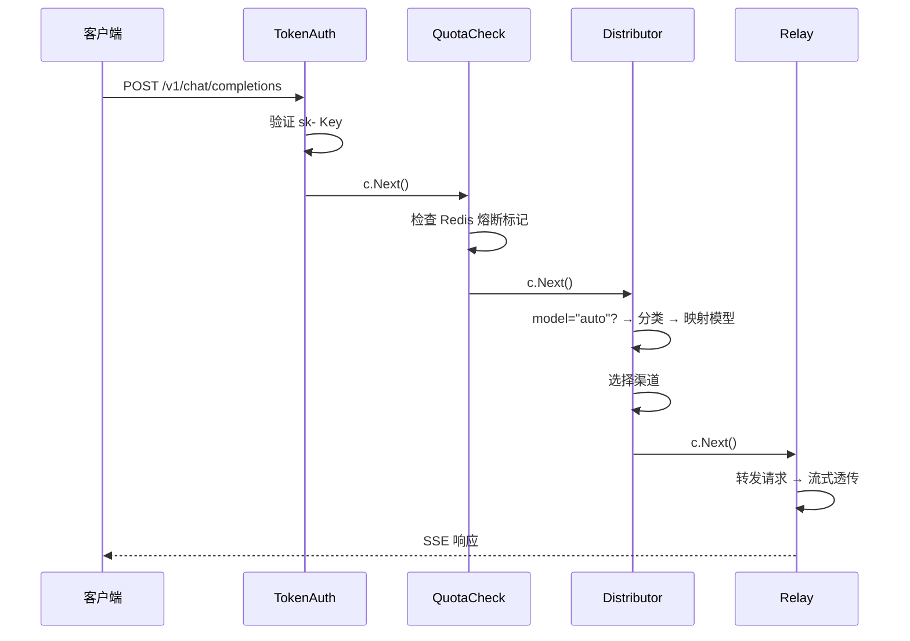

# asterisk-token-router 架构文档

> 设计决策、技术选型、扩展指南

---

## 1. 设计原则

### 1.1 修改最小化

基于 One API 的二次开发遵循 **最小侵入原则**：

- **数据模型扩展**：新增字段而非新建表（Channel 加计费字段）
- **中间件管道**：新增中间件插入现有链，不修改 Relay 核心逻辑
- **回调模式**：回避 `common ↔ model` 循环依赖，用回调/接口解耦

### 1.2 循环依赖解决

One API 的 `common` 和 `model` 包存在双向引用。新增代码必须避开：

```
✅ 允许: model → common
✅ 允许: middleware → common, middleware → model  
❌ 禁止: common → model (循环依赖)
```

解决方案：`common/alert.go` 使用 `AlertRecorder` 回调，由 `model/alert.go` 注册。

---

## 2. 请求生命周期



中间件顺序: `RelayPanicRecover → TokenAuth → QuotaCheck → Distribute → Relay`

---

## 3. 核心模块设计

### 3.1 内容分类器 (`middleware/content_classifier.go`)

```
ContentClassifier
├── OfficeKeywords      []string   # 办公关键词 → basic
├── AdvancedKeywords    []string   # 技术关键词 → advanced
├── ShortTextThreshold  int        # 短文本阈值 (100)
├── LongTextThreshold   int        # 长文本阈值 (2000)
└── Classify(messages)  → "basic" | "advanced"
```

**分类流程**：
1. 提取最后一条 `role=user` 消息
2. 检测代码特征（markdown 代码块 / 编程关键字）→ advanced
3. 匹配高级关键词 → advanced
4. 长文本 (>2000字) + 非办公内容 → advanced
5. 默认 → basic

### 3.2 Auto 路由器 (`middleware/auto_router.go`)

当 `model="auto"` 时：
1. 读取请求 Body（从 `common.GetRequestBody` 缓存）
2. 解析 `messages` 字段
3. 调用 `ContentClassifier.Classify()`
4. 映射到默认模型（basic→gpt-4o-mini, advanced→gpt-4o）
5. 继续标准渠道选择流程

### 3.3 配额系统 (`common/quota.go`)

Redis Key 设计：

```
asterisk:user:{userId}:quota:{YYYY-MM}    # Float64 周期用量
asterisk:user:{userId}:blocked            # 熔断标记
asterisk:user:{userId}:alert:{level}:{YYYY-MM}  # 告警已发送标记
```

- 每月自动创建新 key，过期 45 天
- `QuotaCheck` 中间件在每次请求前检查 `blocked` 标记
- `CheckAndAlert` 在调用后异步执行阈值判定

### 3.4 告警系统 (`common/alert.go` + `model/alert.go`)

```
CheckAndAlert()
├── pct >= 100% → BlockUser() → 记录 level=3 → 企业微信通知
├── pct >= 90%  → 记录 level=2 → 企业微信通知
├── pct >= 80%  → 记录 level=1 → 企业微信通知
└── pct < 80%   → 无操作
```

- 每级别每月只通知一次（防重复）
- 通知异步 goroutine 发送，不阻塞请求

### 3.5 通知模块 (`common/notifier/`)

```
Notifier 接口
├── Send(userId, username, level, pct, usage, limit)
│
├── WeComNotifier     # 企业微信 Markdown 消息
├── (future) FeishuNotifier
├── (future) DingTalkNotifier
└── (future) EmailNotifier
```

---

## 4. 数据模型变更

### 4.1 Channel 新增字段

| 字段 | 类型 | 默认值 | 说明 |
|------|------|:---:|------|
| `billing_mode` | int | 1 | 0=包月, 1=按量, 2=免费 |
| `price_in` | float64 | 0 | 输入单价 元/千token |
| `price_out` | float64 | 0 | 输出单价 元/千token |
| `call_limit` | int64 | 0 | 包月调用上限, 0=不限 |
| `call_count` | int64 | 0 | 当月已调用次数 |

### 4.2 新表: alerts

| 字段 | 类型 | 说明 |
|------|------|------|
| `id` | int PK | 自增 |
| `user_id` | int | 关联用户 |
| `level` | int | 1=80%, 2=90%, 3=100% |
| `threshold_pct` | int | 触发百分比 |
| `handled` | bool | 是否已处理 |
| `created_at` | int64 | 时间戳 |

---

## 5. 配置项

### 5.1 环境变量

| 变量 | 说明 | 默认值 |
|------|------|:---:|
| `SQL_DSN` | 数据库连接 | 必填 |
| `REDIS_CONN_STRING` | Redis 连接 | 必填 |
| `SESSION_SECRET` | 会话密钥 | 必填 |
| `TZ` | 时区 | `Asia/Shanghai` |

### 5.2 系统选项（数据库）

| 选项 | 说明 |
|------|------|
| `WeComWebhookURL` | 企业微信 Webhook 地址 |
| `QuotaThresholds` | 阈值配置 JSON |

---

## 6. 扩展指南

### 添加新通知渠道

1. 实现 `notifier.Notifier` 接口
2. 在初始化代码中注册
```go
notifier := notifier.NewFeishuNotifier(webhookURL)
common.SetNotifier(notifier)
```

### 添加新模型供应商

无需改代码：后台 → 渠道 → 类型选择「自定义」→ 填写 Base URL + API Key。

### 修改分类规则

编辑 `middleware/content_classifier.go` 的 `NewContentClassifier()` 中的关键词列表，或通过数据库选项动态加载。

---

## 7. 上游兼容性

本项目基于 One API `main` 分支。上游更新时：

1. `git fetch upstream main`
2. `git merge upstream/main`
3. 重点检查冲突区域：
   - `model/channel.go` (新增计费字段)
   - `middleware/distributor.go` (auto 路由)
   - `router/relay.go` (QuotaCheck 中间件)
   - `main.go` (初始化注册)
4. 运行全部测试: `go test ./...`
