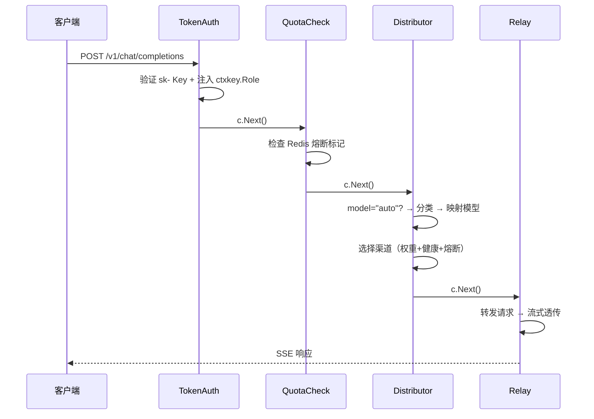

# asterisk-token-router 架构文档

> 设计决策、技术选型、扩展指南
> 版本: v1.1.19 | 日期: 2026-08-12

---

## 1. 设计原则

### 1.1 修改最小化

基于 One API 的二次开发遵循 **最小侵入原则**：

- **数据模型扩展**：新增字段而非新建表（Channel 加计费/熔断字段；User 加月度额度）
- **中间件管道**：新增中间件插入现有链，不修改 Relay 核心逻辑
- **回调模式**：回避 `common ↔ model` 循环依赖，用回调/接口解耦

### 1.2 循环依赖解决

One API 的 `common` 和 `model` 包存在双向引用。新增代码必须避开：

```
✅ 允许: model → common
✅ 允许: middleware → common, middleware → model  
❌ 禁止: common → model (循环依赖)
```

---

## 2. 请求生命周期


```mermaid
sequenceDiagram
    participant C as 客户端
    participant M1 as TokenAuth
    participant M2 as QuotaCheck
    participant M3 as Distributor
    participant R as Relay

    C->>M1: POST /v1/chat/completions
    M1->>M1: 验证 sk- Key + 注入 ctxkey.Role
    M1->>M2: c.Next()
    M2->>M2: 检查 Redis 熔断标记
    M2->>M3: c.Next()
    M3->>M3: model="auto"? → 分类 → 映射模型
    M3->>M3: 选择渠道（权重+健康+熔断）
    M3->>R: c.Next()
    R->>R: 转发请求 → 流式透传
    R-->>C: SSE 响应
```

中间件顺序: `RelayPanicRecover → TokenAuth → QuotaCheck → Distribute → Relay`

**关键变更 (v1.1.x)**：`TokenAuth` 中间件在验证令牌后查询用户角色并注入 `ctxkey.Role`，修复管理员权限判断。

---

## 3. 核心模块设计

### 3.1 渠道模型 (`model/channel.go`)

```go
type Channel struct {
    // ... One API 原有字段 ...
    ChannelGroup    string  `json:"channel_group"`     // 渠道组 (v1.1.0)
    BillingType     int     `json:"billing_type"`      // 0=预充值 1=月结 2=订阅 (v1.1.0)
    WarningPct      int     `json:"warning_pct"`       // 预警百分比 (v1.1.0)
    BreakerPct      int     `json:"breaker_pct"`       // 熔断百分比 (v1.1.0)
    RechargeAmount  float64 `json:"recharge_amount"`   // 充值金额 (v1.1.0)
    RechargeTime    int64   `json:"recharge_time"`     // 充值时间 (v1.1.0)
    CurrentBalance  float64 `json:"current_balance"`   // 当前余额 (v1.1.0)
}
```

### 3.2 用户模型 (`model/user.go`)

```go
type User struct {
    // ... One API 原有字段 ...
    Quota         int64 `json:"quota"`           // 总额度 remain_quota (v1.1.4 重命名)
    MonthlyQuota  int64 `json:"monthly_quota"`   // 月度额度 0=不限 (v1.1.4 新增)
}
```

### 3.3 Auto 路由器 (`middleware/auto_router.go`)

当 `model="auto"` 时：
1. 读取请求 Body（从 `common.GetRequestBody` 缓存）
2. 解析 `messages` 字段
3. 调用 `ContentClassifier.Classify()`
4. 映射到默认模型（basic→qwen-max, advanced→deepseek-chat）
5. 继续标准渠道选择流程

### 3.4 配额系统 (`common/quota.go` + `middleware/quota_check.go`)

**计费公式 (v1.1.7 最终)**：
```
内部消耗 = tokens × model_ratio
显示金额 = 内部消耗 ÷ 1,000,000
用户 ¥20 = 20,000,000 内部单位
```

**核心常量**：

| 参数 | 值 | 说明 |
|------|:--:|------|
| QuotaPerUnit | 1,000,000 | 每百万 token = ¥1 |
| PreConsumedQuota | 0 | 金额制下不预扣 |
| USD (modelRatio基准) | 36 | ¥/M token 计价 |

**熔断逻辑**：
- 预充值 (billing_type=0)：`current_balance < recharge_amount × 20%` 预警，`current_balance ≤ 0` 熔断
- 月结 (billing_type=1)：`monthly_used / budget > 80%` 预警，`> 98%` 熔断
- 订阅 (billing_type=2)：无配额控制

### 3.5 前端路由守卫 (`web/default/src/components/AdminRoute.js`)

```jsx
// v1.1.1 新增，v1.1.19 补全 /channel
function AdminRoute({ children }) {
  const { userState } = useContext(UserContext);
  if (!isAdmin(userState.user)) {
    return <Navigate to="/mytoken" replace />;
  }
  return children;
}
```

**受保护路由**：`/channel`, `/channel/*`, `/token`, `/token/*`, `/user`, `/user/*`, `/redemption`, `/log`, `/quota`

### 3.6 仪表盘按角色 (`model/log.go` + `controller/dashboard.go`)

**多查询架构 (v1.1.2)**：

| 查询函数 | 用途 | 角色 |
|---------|------|:--:|
| `SearchLogsByDayAndModel` | 按模型趋势 | 全部 |
| `SearchLogsByDayAndChannel` | 按渠道趋势 | 普通用户 |
| `SearchLogsByDayAndToken` | 按令牌趋势 | 管理员 |
| `SearchLogsByDayAndTotal` | 总消费趋势 | 全部 |
| `SearchLogsByUserAndChannel` | 分用户按渠道 | 管理员 |
| `SearchLogsByUserAndConsumption` | 分用户按消费 | 管理员 |

---

## 4. 数据模型变更 (v1.1.x 完整)

### 4.1 Channel 新增字段

| 字段 | 类型 | 默认值 | 版本 | 说明 |
|------|------|:---:|:---:|------|
| `channel_group` | string | "" | v1.1.0 | 渠道分组（basic/advanced/premium） |
| `billing_type` | int | 1 | v1.1.0 | 0=预充值, 1=月结, 2=订阅 |
| `warning_pct` | int | 0 | v1.1.0 | 预警百分比 |
| `breaker_pct` | int | 0 | v1.1.0 | 熔断百分比 |
| `recharge_amount` | float64 | 0 | v1.1.0 | 充值金额 |
| `recharge_time` | int64 | 0 | v1.1.0 | 充值时间 |
| `current_balance` | float64 | 0 | v1.1.0 | 当前余额 |

### 4.2 User 新增/重命名字段

| 字段 | 类型 | 变更 | 版本 |
|------|------|------|:---:|
| `remain_quota` | int64 | quota 重命名 | v1.1.4 |
| `monthly_quota` | int64 | 新增，0=不限 | v1.1.4 |

### 4.3 新表: quota_requests

| 字段 | 类型 | 说明 |
|------|------|------|
| `id` | int PK | 自增 |
| `user_id` | int | 申请人 |
| `token_id` | int | 关联令牌 |
| `amount` | int | 申请额度 |
| `status` | int | 0=待审 1=通过 2=拒绝 |
| `created_at` | int64 | 时间戳 |

---

## 5. 配置项

### 5.1 环境变量

| 变量 | 说明 | 默认值 |
|------|------|:---:|
| `SQL_DSN` | 数据库连接 | 必填 |
| `REDIS_CONN_STRING` | Redis 连接 | 必填 |
| `SESSION_SECRET` | 会话密钥（固定值，防止重启掉线） | 必填 |
| `TZ` | 时区 | `Asia/Shanghai` |

### 5.2 系统选项（数据库）

| 选项 | 值 | 说明 |
|------|:--:|------|
| `QuotaPerUnit` | 1,000,000 | 配额单位（严禁修改） |
| `PreConsumedQuota` | 0 | 预消费配额 |
| `QuotaForNewUser` | 10,000,000 | 新用户默认额度(¥10) |

---

## 6. 前端组件结构

### 6.1 独立组件（容易改错）

| 页面 | 组件文件 | 说明 |
|------|---------|------|
| 创建用户 `/user/add` | `AddUser.js` | 独立于 EditUser |
| 编辑用户 `/user/edit/:id` | `EditUser.js` | 独立于 AddUser |
| 普通用户令牌 `/mytoken` | `MyToken.js` | 独立于 TokensTable |
| 管理员令牌列表 `/token` | `TokensTable.js` | 独立于 MyToken |
| 添加/编辑令牌 | `EditToken.js` | 共用组件 |

### 6.2 角色渲染

- `renderQuota(quota)` → `¥{(quota/1000000).toFixed(2)}` （v1.1.8 统一）
- `isAdmin(user)` → `user?.role >= 10`
- `isRoot(user)` → `user?.role >= 100`

---

## 7. 扩展指南

### 添加新通知渠道

1. 实现 `notifier.Notifier` 接口
2. 在初始化代码中注册

### 添加新模型供应商

无需改代码：后台 → 渠道 → 类型选择「自定义」→ 填写 Base URL + API Key → 选择渠道组。

### 修改路由权限

编辑 `App.js` 中对应 `<Route>` 的包裹组件：
- `AdminRoute` → role >= 10
- `PrivateRoute` → 已登录
- 无包裹 → 公开访问

---

## 8. 上游兼容性

本项目基于 One API `main` 分支。上游更新时：

1. `git fetch upstream main`
2. `git merge upstream/main`
3. 重点检查冲突区域：
   - `model/channel.go` (新增计费/熔断字段)
   - `model/user.go` (月度额度字段)
   - `middleware/auth.go` (ctxkey.Role 注入)
   - `middleware/distributor.go` (auto 路由)
   - `router/web.go` (go:embed 路径)
   - `web/default/src/App.js` (AdminRoute 包裹)
4. 运行全部测试: `go test ./...`
5. 验证前端嵌入: `./scripts/build.sh linux` → 二进制 ≥ 35MB
