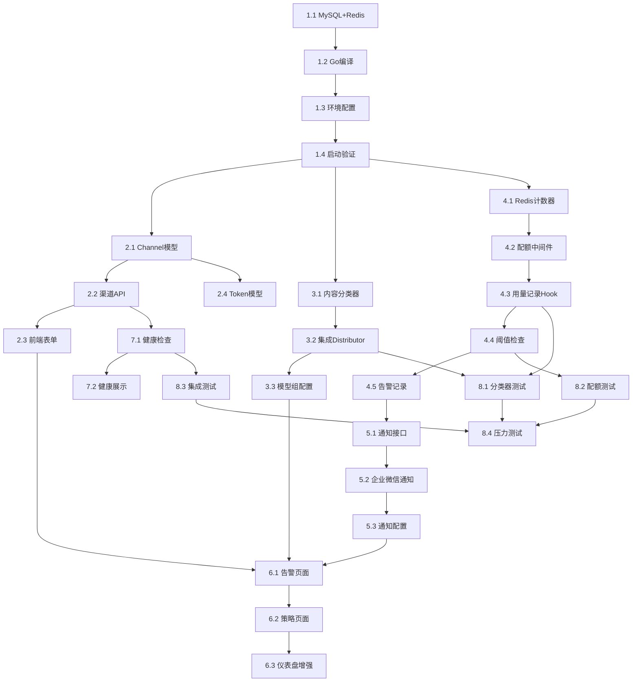

# asterisk-token-router 实施计划

> **For Hermes:** Use subagent-driven-development skill to implement this plan task-by-task.

**Goal:** 基于 One API (MIT) 源码，二次开发为公司内部 Token Router，实现智能路由、计费区分、阈值告警熔断、企业微信通知。

**Architecture:** 在 One API 现有管道中插入三个新中间件（内容路由器、配额检查器、用量记录器），扩展 Channel 数据模型增加计费字段，新增告警通知模块。

**Tech Stack:** Go 1.26, Gin, GORM, MySQL, Redis, 企业微信 Webhook

**项目路径:** `/Users/daojun/Dev/asterisk-token-router`

---

## Phase 1: 环境搭建与代码探索 (Day 1)

### Task 1.1: 完成 MySQL + Redis 安装与启动

**Objective:** 安装并启动本地开发数据库

**Files:** None (infrastructure)

**Steps:**
1. 安装: `brew install mysql redis`（已在后台执行中）
2. 启动 MySQL: `brew services start mysql`
3. 启动 Redis: `brew services start redis`
4. 创建数据库: `mysql -u root -e "CREATE DATABASE asterisk_token_router CHARACTER SET utf8mb4;"`
5. 验证: `redis-cli ping` → PONG

**Verification:**
```bash
mysql -u root -e "SHOW DATABASES;" | grep asterisk
redis-cli ping
```

### Task 1.2: Go 依赖安装与编译验证

**Objective:** 拉取依赖并确认项目可编译

**Files:** None

**Steps:**
1. `cd /Users/daojun/Dev/asterisk-token-router`
2. `go mod download`
3. `go build -o bin/asterisk-tr .`
4. 验证二进制文件生成

**Verification:**
```bash
ls -la bin/asterisk-tr
./bin/asterisk-tr --help 2>&1 | head -5
```

### Task 1.3: 配置本地环境变量

**Objective:** 创建 .env 文件指向本地 MySQL/Redis

**Files:**
- Create: `.env`

**Steps:**
1. 复制 `.env.example` → `.env`
2. 设置 `SQL_DSN=root:@tcp(localhost:3306)/asterisk_token_router?charset=utf8mb4&parseTime=True&loc=Local`
3. 设置 `REDIS_CONN_STRING=redis://localhost:6379`
4. 设置 `SESSION_SECRET=dev-secret-change-in-production`

### Task 1.4: 启动验证

**Objective:** 启动 One API 确认基础功能正常

**Steps:**
1. `./bin/asterisk-tr --port 3000 --log-dir ./logs`
2. 访问 `http://localhost:3000`
3. 使用 root/123456 登录
4. 确认 User/Channel/Token 页面可访问

---

## Phase 2: 计费模式扩展 (Day 2-3)

### Task 2.1: 扩展 Channel 数据模型

**Objective:** 为渠道增加计费模式、单价、调用上限字段

**Files:**
- Modify: `model/channel.go:20-45`

**Implementation:**
```go
// 在 Channel struct 中新增字段:
BillingMode  int     `json:"billing_mode" gorm:"default:1"`   // 0=包月, 1=按量, 2=免费
PriceIn      float64 `json:"price_in" gorm:"default:0"`       // 输入单价 元/千token
PriceOut     float64 `json:"price_out" gorm:"default:0"`      // 输出单价 元/千token
CallLimit    int64   `json:"call_limit" gorm:"default:0"`     // 包月调用上限 0=不限
CallCount    int64   `json:"call_count" gorm:"default:0"`     // 当月调用次数
```

**Verification:** `go build` 通过，启动后数据库自动迁移

### Task 2.2: 扩展渠道 API (CRUD)

**Objective:** 渠道创建/编辑接口支持新字段

**Files:**
- Modify: `controller/channel.go` (AddChannel, UpdateChannel 函数)

**Implementation:**
- 在 AddChannel/UpdateChannel 的请求绑定中增加 billing_mode, price_in, price_out, call_limit 字段
- 将这些字段写入 Channel 对象并保存

**Verification:**
```bash
curl -X POST http://localhost:3000/api/channel/ \
  -H "Authorization: Bearer <root-token>" \
  -d '{"name":"test","type":1,"key":"sk-xxx","models":"gpt-4o","billing_mode":1,"price_in":0.1,"price_out":0.2}'
```

### Task 2.3: 扩展前端渠道表单

**Objective:** 渠道管理页面增加计费模式选择和新字段输入

**Files:**
- Modify: `web/default/src/pages/Channel/EditChannel.js` (或对应 Vue 组件)
- Modify: `web/default/src/pages/Channel/`

**Implementation:**
- 添加"计费模式"下拉框 (包月/按量/免费)
- 条件显示: 按量模式下显示输入/输出单价输入框
- 条件显示: 包月模式下显示调用次数上限输入框

### Task 2.4: Token 模型扩展

**Objective:** Token 增加关联的模型组权限字段，支持按模型组授权

**Files:**
- Modify: `model/token.go`

**Implementation:**
- 在 Token struct 中确认 `Models` 字段已支持模型白名单
- 扩展 `Group` 字段语义支持 business group

---

## Phase 3: 内容路由器 (Day 4-6)

### Task 3.1: 创建内容分类器

**Objective:** 实现基于规则的内容分类引擎

**Files:**
- Create: `middleware/content_classifier.go`

**Implementation:**
```go
package middleware

type ContentClassifier struct {
    AdvancedKeywords []string // 代码、debug、架构、算法...
    OfficeKeywords   []string // 翻译、总结、问答、写邮件...
}

func NewClassifier() *ContentClassifier { ... }
func (c *ContentClassifier) Classify(messages []Message) string {
    // 1. 提取最后一条 user 消息
    // 2. 规则匹配 → "advanced" / "basic"
}
```

### Task 3.2: 修改 Distributor 集成内容路由

**Objective:** 在渠道选择前插入内容分类逻辑

**Files:**
- Modify: `middleware/distributor.go` (Distribute 函数, 约 25-80 行)

**Implementation:**
```go
// 在 requestModel 解析之后, channel 选择之前:
if requestModel == "auto" || requestModel == "" {
    classifier := NewClassifier()
    // 提取请求 body 中的 messages
    category := classifier.Classify(messages)
    // 根据 category 映射到模型组
    requestModel = mapCategoryToModelGroup(category, userGroup)
}
```

### Task 3.3: 模型组配置管理

**Objective:** 支持管理员配置模型组与分类映射

**Files:**
- Modify: `model/option.go` (或新增配置表)
- Modify: `controller/option.go`

**Implementation:**
- 新增系统配置项: `ModelGroupMapping` JSON 配置
- Web 配置界面: 模型组 → 渠道关联

---

## Phase 4: 用量监控与熔断 (Day 7-9)

### Task 4.1: Redis 用量计数器

**Objective:** 实现基于 Redis 的用户周期用量计数

**Files:**
- Create: `common/quota.go`

**Implementation:**
```go
func IncrUserQuota(userId int, cost float64) (float64, error) {
    key := fmt.Sprintf("user:%d:quota:%s", userId, currentMonth())
    return RedisClient.IncrByFloat(key, cost)
}

func IsUserBlocked(userId int) bool { ... }
func BlockUser(userId int) error { ... }
func UnblockUser(userId int) error { ... }
```

### Task 4.2: 配额检查中间件

**Objective:** 请求前检查用户是否被熔断

**Files:**
- Create: `middleware/quota.go`

**Implementation:**
```go
func QuotaCheck() func(c *gin.Context) {
    // 在 auth 之后, distributor 之前
    // 检查 Redis blocked 标记
    // 如果已熔断 → 429
    // 否则 → c.Next()
}
```

### Task 4.3: 用量记录 Hook

**Objective:** API 调用完成后记录用量并检查阈值

**Files:**
- Modify: `relay/controller/text.go` (或相关 relay handler)
- Create: `middleware/usage_recorder.go`

**Implementation:**
- 在流式响应结束后异步执行:
  1. 计算费用 = (prompt_tokens × price_in + completion_tokens × price_out) / 1000
  2. 若 billing_mode=subscription → cost=0
  3. Redis INCRBY 周期用量
  4. 检查 80%/90%/100% 阈值
  5. 触发告警或熔断

### Task 4.4: 阈值检查与告警触发

**Objective:** 实现三级阈值判定逻辑

**Files:**
- Create: `common/alert.go`

**Implementation:**
```go
func CheckThresholds(userId int, currentUsage float64, quotaLimit float64) {
    pct := currentUsage / quotaLimit
    switch {
    case pct >= 1.0: triggerBlock(userId)
    case pct >= 0.9: sendAlert(userId, 90)
    case pct >= 0.8: sendAlert(userId, 80)
    }
}
```

### Task 4.5: 告警记录持久化

**Objective:** 告警记录存入数据库

**Files:**
- Create: `model/alert.go`

**Implementation:**
```go
type Alert struct {
    Id          int
    UserId      int
    Level       int    // 1=80% 2=90% 3=100%
    ThresholdPct int
    NotifiedTo  string
    Handled     bool
    CreatedAt   int64
}
```

---

## Phase 5: 企业微信通知 (Day 10-11)

### Task 5.1: 通知抽象接口

**Objective:** 定义 Notifier 接口，支持多渠道扩展

**Files:**
- Create: `common/notifier/notifier.go`
- Create: `common/notifier/wecom.go`

**Implementation:**
```go
type Notifier interface {
    Send(userId int, level int, message string) error
}

type WeComNotifier struct {
    WebhookURL string
}
```

### Task 5.2: 企业微信 Markdown 通知

**Objective:** 构建告警消息模板并发送

**Files:**
- Modify: `common/notifier/wecom.go`

**Implementation:**
```go
func (w *WeComNotifier) SendAlert(alert *model.Alert, user *model.User) error {
    msg := fmt.Sprintf(`## ⚠️ Token Router 用量告警
> 用户: %s (%s)
> 级别: %s
> 用量: %.2f/%.2f 元 (%.0f%%)
`, user.Username, user.Department, levelDesc, ...)
    
    return w.sendMarkdown(msg)
}
```

### Task 5.3: 通知配置管理

**Objective:** 管理员可在后台配置 Webhook URL

**Files:**
- Modify: `model/option.go` (新增 wecom_webhook 配置项)
- Modify: `controller/option.go`

---

## Phase 6: 管理后台增强 (Day 12-14)

### Task 6.1: 告警记录页面

**Objective:** 管理员查看和处理告警

**Files:**
- Create: `web/default/src/pages/Alert/`

### Task 6.2: 用量阈值策略页面

**Objective:** 配置阈值百分比和启用/禁用

**Files:**
- Create: `web/default/src/pages/QuotaPolicy/`

### Task 6.3: 费用仪表盘增强

**Objective:** 费用趋势图、模型费用饼图

**Files:**
- Modify: `web/default/src/pages/Dashboard/`

---

## Phase 7: 渠道健康检查 (Day 15)

### Task 7.1: 定时健康检查

**Objective:** 每 60s 检查渠道可用性，自动禁用/恢复

**Files:**
- Create: `common/health_checker.go`

### Task 7.2: 健康状态展示

**Objective:** 渠道列表显示健康状态

**Files:**
- Modify: `web/default/src/pages/Channel/`

---

## Phase 8: 测试与集成 (Day 16-18)

### Task 8.1: 单元测试 - 内容分类器

**Files:**
- Create: `middleware/content_classifier_test.go`

### Task 8.2: 单元测试 - 配额计数

**Files:**
- Create: `common/quota_test.go`

### Task 8.3: 集成测试 - 端到端路由

**Files:**
- Create: `tests/e2e_routing_test.sh`

### Task 8.4: 压力测试

```bash
wrk -t4 -c100 -d30s --script=test.lua http://localhost:3000/v1/chat/completions
```

---

## Task Dependency Map



---

## Files Changed Summary

| 文件 | 操作 | Phase |
|------|------|:---:|
| `model/channel.go` | 修改 - 加计费字段 | 2 |
| `model/token.go` | 修改 - 模型组 | 2 |
| `model/alert.go` | **新建** - 告警模型 | 4 |
| `controller/channel.go` | 修改 - API | 2 |
| `controller/option.go` | 修改 - 配置 | 3,5 |
| `controller/quota.go` | **新建** - 配额API | 4 |
| `middleware/content_classifier.go` | **新建** | 3 |
| `middleware/distributor.go` | 修改 - 集成路由 | 3 |
| `middleware/quota.go` | **新建** | 4 |
| `middleware/usage_recorder.go` | **新建** | 4 |
| `common/quota.go` | **新建** - Redis计数 | 4 |
| `common/alert.go` | **新建** - 阈值逻辑 | 4 |
| `common/notifier/notifier.go` | **新建** - 接口 | 5 |
| `common/notifier/wecom.go` | **新建** - 企业微信 | 5 |
| `common/health_checker.go` | **新建** | 7 |
| `relay/controller/text.go` | 修改 - 用量记录 | 4 |
| `web/default/src/pages/Channel/` | 修改 - 表单 | 2 |
| `web/default/src/pages/Alert/` | **新建** | 6 |
| `web/default/src/pages/Dashboard/` | 修改 | 6 |
