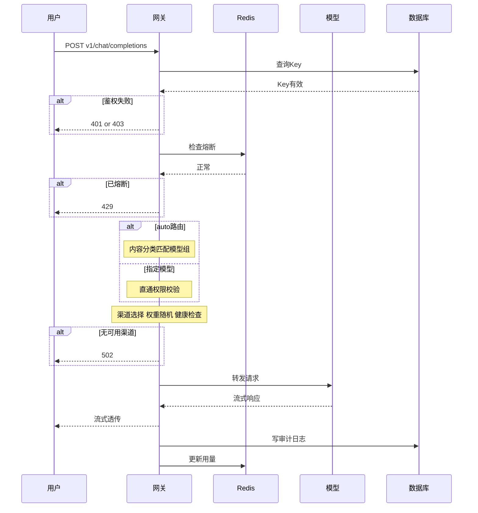
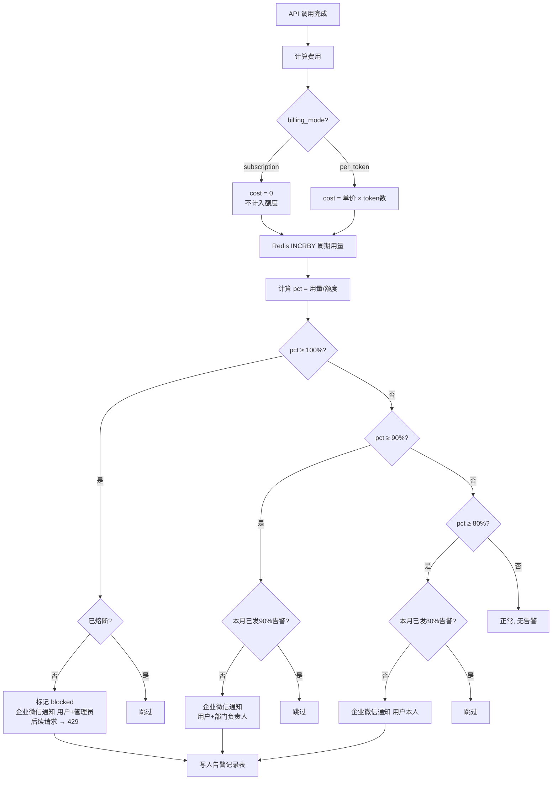
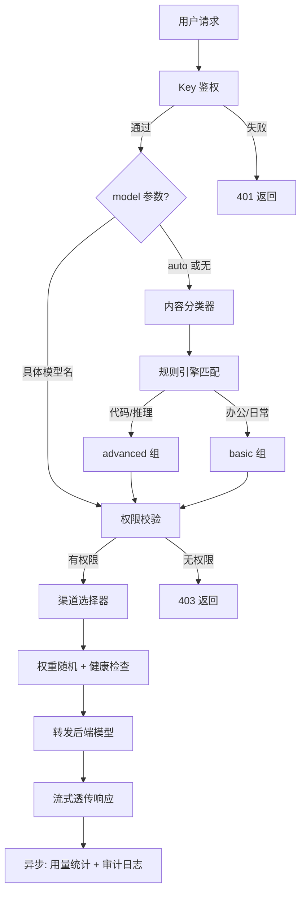
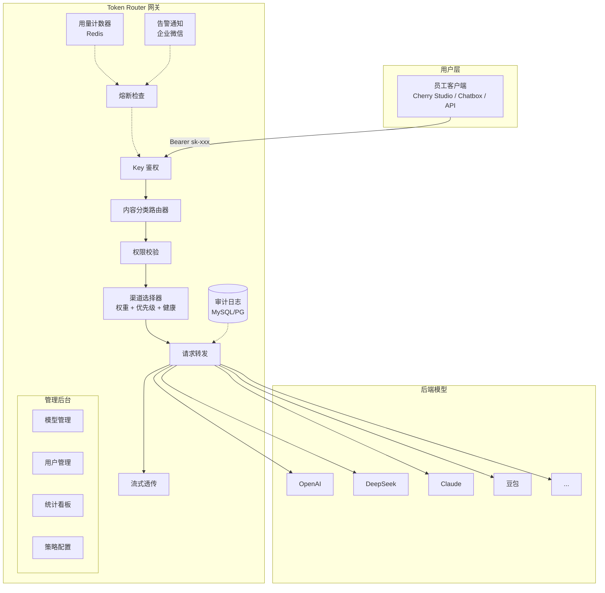
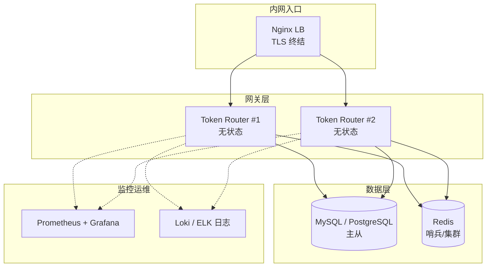
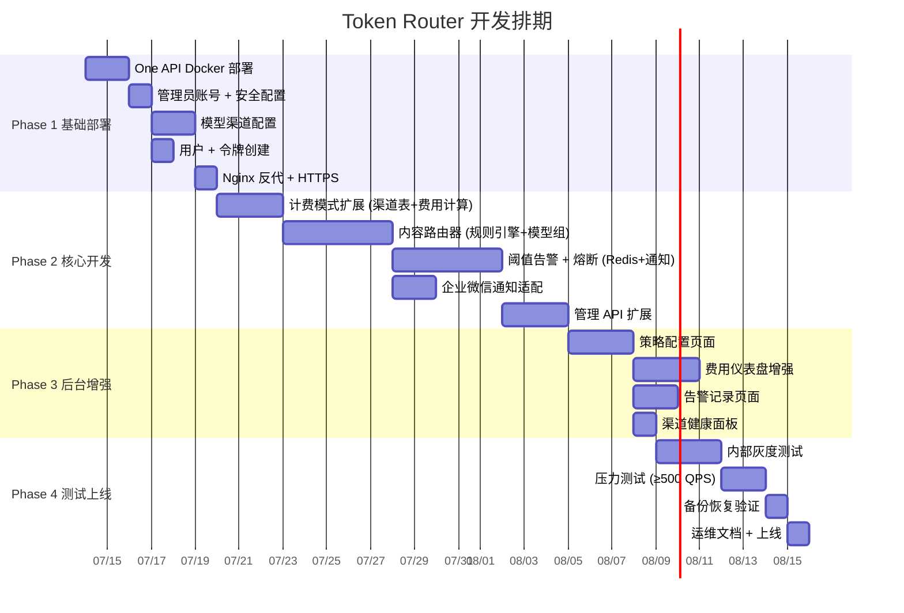

# Token Router — 详细需求说明书

> **基于项目**: One API (songquanpeng/one-api, MIT)  
> **目标许可**: Apache 2.0（便于后续出商业版）  
> **版本**: v2.1  
> **日期**: 2026-07-08  
> **状态**: 需求已对齐  
> **说明**: 本文档忽略用户原始 PRD 的第 6 章（数据结构）和第 7 章（API 设计），采用 One API 原生数据模型和 API 规范。

---

## 1. 项目定位与选型依据

### 1.1 选型结论

**采用 One API / New API 作为基础平台，进行配置 + 二次开发。**

| 维度 | One API 原生覆盖 | New API 增强覆盖 |
|------|:---:|:---:|
| 多模型 API 管理（F1.1） | ✅ 渠道 CRUD、负载均衡 | ✅ 增强 UI、批量管理 |
| 路由策略（F1.2） | ⚠️ 按模型名路由，无内容分类 | 同 |
| 用户管理 + Key 生成（F2.1-2.3） | ✅ 完整支持 | ✅ 增强 + 计费配额 |
| 用量统计（F3.1、F3.3） | ✅ 按 Key 统计 | ✅ 企业级费用核算 |
| 阈值告警（F3.2） | ❌ 不原生支持 | ❌ 不原生支持 |
| Web 管理后台（F4.1-4.5） | ✅ 完整后台 | ✅ 全新 UI |
| 计费模式区分（F1.3） | ⚠️ 无包月/按量标记 | ⚠️ 有计费但无模式区分 |
| 多语言 | ✅ 中/英/日 | ✅ 中/英/日/法 |
| 数据库 | SQLite / MySQL | SQLite / MySQL / PostgreSQL |
| 自注册登录 | ✅ GitHub/微信/邮箱 | ✅ + Discord/LinuxDO/Telegram/OIDC |
| 许可 | MIT | AGPLv3 |

### 1.2 选型决策：One API (MIT) → 目标许可 Apache 2.0

> **New API（AGPLv3）已排除**：AGPLv3 为强 copyleft 许可，要求所有二次开发的代码必须以 AGPLv3 开源，与后续出商业版的计划冲突。  
> **One API（MIT）** 无合规风险：MIT 许可允许修改、闭源、商用，可再许可为 Apache 2.0，完全满足后续商业化需求。

---

## 2. 需求-实现映射矩阵

### 2.1 直接使用（配置即可，无需开发）✅

| PRD ID | 功能 | One API 实现方式 |
|--------|------|-----------------|
| F1.1 | 模型 Key CRUD | 后台「渠道」页面，支持 OpenAI/Azure/Claude/Gemini/DeepSeek/豆包/文心/通义/讯飞/360/混元等 |
| F1.4 | 统一 API 端点 `/v1/chat/completions` | 原生支持，OpenAI 兼容格式，流式透传 |
| F2.1 | 用户 CRUD | 后台「用户管理」，支持增删改查、充值/扣费 |
| F2.2 | 分组权限 | 「用户分组」+「令牌」绑定模型权限 |
| F2.3 | Key 生成/重置 | 「令牌管理」，支持 `sk-` 格式，可设过期、额度、模型白名单 |
| F3.1 | 用量追踪 | 后台「日志」页面，每次调用记录 token 数、模型、费用 |
| F3.4 | 审计日志 | 内置日志系统，持久化存储 |
| F4.1 | 管理员认证 | 内置登录（root/123456），可配 OAuth（GitHub/微信等） |
| F4.2 | 模型管理界面 | 渠道管理页面 |
| F4.3 | 用户管理界面 | 用户管理 + 令牌管理页面 |
| F4.4 | 仪表盘 | 内置「控制台」统计数据 |
| N4 | Docker 部署 | `docker run` 一行启动，sqlite 开箱即用 |
| N5 | 新增模型免改代码 | 添加渠道即可接入任意 OpenAI 兼容 API |
| N6 | 日志审计 | 日志页面可查询历史 |

### 2.2 配置适配（需自定义配置，少量开发）⚙️

| PRD ID | 功能 | 实现方案 |
|--------|------|---------|
| R1.2 | 包月/按量计费模式标记 | 利用 One API 渠道的「倍率」字段：包月模型倍率=0（不计 token 费），按量模型倍率=1；或扩展渠道表增加 `billing_mode` 字段 |
| R1.5 | 模型优先级/权重 | One API 原生支持渠道加权随机（设置权重），同模型多渠道自动按权重分流 |
| R1.7 | 渠道健康检查 | 需增加健康检查定时任务（Go 代码），检测渠道可用性，自动禁用故障渠道 |
| F1.3 | 计费区分逻辑 | 配置策略：包月模型费用独立统计不计入用户额度；按量模型计入 |
| R2.6 | 用户组/角色 | One API 原生「用户分组」，可设置不同倍率 |
| R3.2 | 费用估算 | One API 按「倍率 × token 数」计算费用，需新增「模型单价」配置 + 费用计算模块 |
| R3.6 | 费用仪表盘 | 需增强前端统计看板，增加费用趋势图、模型费用占比 |
| R4.5 | 策略配置界面 | 增加阈值设置、通知渠道配置页面 |

### 2.3 需要开发（One API 不原生支持）🔨

| PRD ID | 功能 | 开发方案 |
|--------|------|---------|
| **F1.2** | **智能路由（内容分类）** | **核心新增功能**。在网关请求处理管道中增加「内容路由器」中间件 |
| **F3.2** | **多级阈值告警** | **核心新增功能**。用量监控 + 通知模块 |
| **F3.5** | **额度熔断** | 与 F3.2 联动，100% 阈值时返回 429 |
| **F1.6** | **模型组概念** | One API 有「分组」但语义不同，需扩展为「办公组/高级组/全部」等业务分组 |
| **R3.3** | **用户额度阈值** | 新增额度管理模块 |
| **R3.4** | **告警通知渠道** | 企业微信/飞书/邮件通知适配 |

---

---


## 3. 功能用例详细规格

> 本章对每个功能用例进行详细描述，包括：参与者、前置条件、输入、输出、主流程、异常流程、业务规则。

### UC-01：添加/编辑/删除后端模型渠道（F1.1）

**参与者**：平台管理员

**前置条件**：管理员已登录管理后台，已获取模型供应商的 API Key 和 Base URL

**主流程**：

```
1. 管理员进入「渠道管理」页面，点击「添加渠道」
2. 填写渠道信息：
   - 渠道名称（自定义标识）
   - 渠道类型（下拉选择：OpenAI / DeepSeek / 豆包 / 文心一言 / 通义千问 / Claude / Gemini / 自定义）
   - 模型名称（如 gpt-4o、deepseek-v3）
   - API Key（供应商密钥）
   - Base URL（API 地址，选填）
   - 计费模式：包月 / 按量 / 免费
     按量模式需填：输入单价、输出单价（元/千 token）
     包月模式可选：调用次数上限（0=不限）
   - 模型分组：基础组 / 高级组 / 全模型组 / 实验组
   - 优先级（整数，大优先）+ 权重（负载均衡）
   - 状态：启用 / 禁用
3. 点击保存，系统验证 Key 有效性
4. 存储渠道（Key AES-256 加密），返回成功
```

**异常流程**：

| 场景 | 处理 |
|------|------|
| Key 验证失败 | 提示错误详情，不保存 |
| 渠道名称重复 | 提示"名称已存在" |
| 必填字段缺失 | 提示具体字段 |
| Base URL 不可达 | 提示超时，允许保存但标记"不可用" |

**输入**：name, type, model, api_key, base_url, billing_mode, price_in/out, call_limit, model_group, priority, weight, status

**输出**：`{"code":0, "data":{"id":12, "health":"ok"}}`

**业务规则**：Key 加密存储、删除前检查依赖、禁用渠道自动降级、同模型可多渠道

---

### UC-02：智能路由——用户发起聊天请求（F1.2）

**参与者**：员工（通过客户端 API 调用）

**前置条件**：持有有效 sk- Key，未被熔断



**主流程**：

```
1. 用户 POST /v1/chat/completions，Header: Bearer sk-xxx
2. 网关解析 Key → 查哈希 → 验证状态 → 查用户状态
3. 熔断检查：Redis 查周期用量，≥100% → 429
4. 模型解析：
   - model="auto" 或无 model → 进入内容路由（步骤5）
   - model="具体名" → 跳权限校验（步骤6）
5. 内容路由：
   a. 提取最后一条 user 消息前 500 字符
   b. 规则分类：代码特征/长文本推理 → advanced；其他 → basic
   c. 从对应组按优先级排序候选渠道
6. 权限校验：查用户组 → 查可访问模型 → 过滤无权限模型 → 403 若无可用
7. 渠道选择：权重随机 + 剔除不健康渠道
8. 转发请求（透传 body，120s 超时）
9. 流式透传响应（SSE）
10. 异步：写审计日志 + 更新用量 + 检查阈值
```

**异常流程**：

| 场景 | HTTP |
|------|:--:|
| Key 无效/过期 | 401 |
| 用户禁用 | 403 |
| 模型越权 | 403（提示可用模型） |
| 额度熔断 | 429 |
| 后端超时 | 502 |
| 全部渠道不可用 | 502 |

**输入**（OpenAI 兼容）：`{"model":"auto","messages":[...],"stream":true}`

**输出**（SSE 流式）：标准 OpenAI chunk 格式，最后一条含 usage 统计

**业务规则**：显式 model 仅做权限校验不分类、路由记录写入日志、故障渠道 5 分钟自动剔除

---

### UC-03：用户管理——创建用户（F2.1）

**参与者**：管理员

**主流程**：

```
1. 管理员进入「用户管理」→「添加用户」
2. 填写：用户名（唯一）、邮箱（告警通知）、工号、部门、
   用户组（普通/技术/AI）、月额度上限（元）、状态
3. 保存 → 系统创建用户记录
4. 自动生成 API Key：48 位随机 + sk- 前缀，SHA-256 哈希存储
5. 返回用户信息 + Key 明文（仅此一次）
```

**输入**：username, email, emp_id, department, group, quota_limit, status

**输出**：`{"user_id":42, "username":"zhangsan", "api_key":"sk-aB3d..."}`

**业务规则**：Key 明文不落库、禁用用户立即拒绝请求、删除前先吊销 Key

---

### UC-04：API Key 管理——生成/重置/吊销（F2.3）

**参与者**：管理员

**生成**：管理员进入用户详情 → 生成 Key → 选权限范围 + 过期时间 → 展示明文一次

**重置**：确认弹窗"旧 Key 立即失效" → 吊销旧 Key → 生成新 Key → 展示明文

**吊销**：确认 → 标记已吊销 → 后续请求 401

**业务规则**：重置立即生效无缓冲、一用户可多令牌、吊销为软删除保留审计

---

### UC-05：用量监控——阈值告警与熔断（F3.1/F3.2/F3.5）

**参与者**：系统自动



**主流程（每次调用后异步执行）**：

```
1. 计算费用：cost = (prompt_tokens × price_in + completion_tokens × price_out) / 1000
   包月模型 cost=0 不计入额度
2. Redis INCRBY user:{id}:quota:month:{YYYY-MM} {cost}
3. pct = current / quota_limit × 100
4. 阈值判定（从高到低）：
   ≥100% 且未熔断 → 标记 blocked，企业微信通知用户+管理员，后续请求 429
   ≥90% 且未发过 → 企业微信通知用户+部门负责人
   ≥80% 且未发过 → 企业微信通知用户本人
5. 每月 1 日 00:00 自动重置计数器和告警标记
```

**恢复**：管理员提升额度或手动恢复 → 删除 blocked 标记 → 重置告警状态

**业务规则**：每级每月仅通知一次、熔断后不消耗后端配额、月初自动重置

---

### UC-06：用量与费用统计看板（F3.3/R3.6）

**参与者**：管理员

**页面展示**：今日/本月费用卡片 + 费用趋势折线图 + 模型费用饼图 + 用户排名柱状图 + Token 趋势

**筛选**：时间范围、用户、模型；支持 CSV/Excel 导出

**API 输出**：`{summary, by_model[], by_user_top10[], daily_trend[]}`

---

### UC-07：管理员认证（F4.1）

**主流程**：访问后台 → 检查 Session → 登录页 → 输入用户名密码 → 验证 → 生成 Session

**安全规则**：5 次失败锁 30 分钟、Session 30 分钟超时、默认 root/123456 首次强制改密

---

### UC-08：渠道健康检查（R1.7）

**参与者**：系统定时任务（每 60 秒）

**主流程**：

```
1. 遍历启用渠道 → POST 测试请求（max_tokens=1, 10s 超时）
2. 2xx → healthy；超时/错误 → unhealthy_count++
3. 连续 3 次 unhealthy → 自动禁用 + 通知管理员
4. 已禁用渠道恢复 → 自动启用
```

**展示**：渠道列表显示健康状态（🟢正常/🔴异常）、延迟、上次检查时间

---

### UC-09：包月模型调用次数管理（F1.3）

**主流程**：

```
1. 管理员配置：billing_mode=subscription, call_limit=10000（0=不限）
2. 每次调用 INCRBY channel:{id}:call_count:month:{YYYY-MM} 1
3. 达上限 → 自动禁用 + 通知管理员
4. 月初自动重置
```


## 4. 二次开发详细设计

### 4.1 智能内容路由器（F1.2）🔨 核心开发项

**架构**：用户请求到达网关后，系统分析请求内容判断任务类型，自动路由到合适的模型组。



**分类规则引擎**（初版采用规则，后续可升级为轻量分类模型）：

```go
// pseudo-code
type ContentClassifier struct {
    OfficeKeywords  []string  // 翻译、总结、问答、写邮件、周报...
    AdvancedKeywords []string // 代码、debug、架构、算法、推理...
}

func (c *ContentClassifier) Classify(messages []Message) string {
    lastUserMsg := getLastUserContent(messages)
    
    // 规则 1：消息长度
    if len(lastUserMsg) < 100 && !containsCodeIndicator(lastUserMsg) {
        return "basic"  // 短消息 → 基础模型
    }
    
    // 规则 2：代码特征检测
    if hasCodeBlock(lastUserMsg) || containsKeywords(lastUserMsg, c.AdvancedKeywords) {
        return "advanced"
    }
    
    // 规则 3：显式 model 参数透传
    // 不做分类，直接使用用户指定的 model
    
    return "basic"  // 默认
}
```

**配置项**（管理员可在后台调整）：
- 每组关键词列表
- 消息长度阈值
- 各组对应的模型渠道

### 4.2 计费模式区分（F1.3 / R1.2）⚙️

**方案**：扩展 One API 渠道/channel 数据结构，增加计费模式字段。

```
channels 表新增字段:
  billing_mode  INT  -- 0=包月(不计 token 费), 1=按量(token 计费), 2=免费
  price_in      DECIMAL  -- 输入单价（元/千 token）
  price_out     DECIMAL  -- 输出单价（元/千 token）
```

**费用计算逻辑**：
```
if billing_mode == 0: 
    cost = 0  (不计入用户额度)
    record_usage_only()
else:
    cost = (prompt_tokens × price_in + completion_tokens × price_out) / 1000
    deduct_from_user_quota(cost)
```

### 4.3 多级阈值告警 + 熔断（F3.2 / F3.5）🔨 核心开发项

**架构**：异步检查 + 消息推送。

```
每次调用完成后:
  更新 Redis 中用户周期用量计数器
  计算用量比例 = used / quota_limit
  
  if 比例 >= 1.0 (100%) 且未被熔断:
      标记用户为熔断状态
      发送告警通知(level=3, 用户+管理员)
      后续该用户所有请求返回 429
  
  elif 比例 >= 0.9 (90%) 且未发送过 90% 告警:
      发送告警(level=2, 用户+部门负责人)
      标记已发送
  
  elif 比例 >= 0.8 (80%) 且未发送过 80% 告警:
      发送告警(level=1, 用户本人)
      标记已发送
```

**告警通知模块**：抽象通知接口，支持多种渠道。

```go
type Notifier interface {
    Send(user User, level AlertLevel, message string) error
}

// 实现
- EmailNotifier     (SMTP)
- WeChatWorkNotifier (企业微信机器人 Webhook)
- FeishuNotifier     (飞书机器人 Webhook)
- DingTalkNotifier   (钉钉机器人 Webhook)
```

**管理后台**：
- 「告警策略」页面：配置各级阈值百分比、通知渠道
- 「告警记录」页面：查看历史告警和处理状态
- 「用户额度」面板：查看/调整用户额度、手动解除熔断

### 4.4 模型组概念（F1.6）⚙️

**方案**：利用 One API 的「分组」机制，配置业务语义分组。

```
后台配置:
  - 基础模型组 (basic): gpt-4o-mini, deepseek-v3, qwen-turbo, ...
  - 高级模型组 (advanced): gpt-4o, claude-3.5-sonnet, deepseek-r1, ...
  - 全模型组 (all): 全部可用模型
  - 实验模型组 (experimental): 新模型测试
  
令牌分配:
  - 普通员工令牌 → 绑定 basic 组
  - 技术骨干令牌 → 绑定 basic + advanced 组
  - AI 研究令牌 → 绑定 all + experimental 组
```

### 4.5 费用仪表盘增强（R3.6）⚙️

需在前端增加或增强以下统计视图：
- 总费用折线图（日/周/月）
- 按模型费用占比饼图
- 按用户费用排名柱状图
- 包月模型固定成本 vs 按量模型变动成本对比
- 费用趋势预测（可选，P2）

---

## 5. 系统架构

### 5.1 整体架构



### 5.2 部署架构



---

## 6. 接口规范

### 6.1 用户侧 API（OpenAI 兼容）

与 One API 原生一致，无变化：

```
POST /v1/chat/completions
Header: Authorization: Bearer sk-xxxxxxxxxxxx
Body: {
  "model": "auto",          // 自动路由
  "messages": [...],
  "stream": true
}
```

`model` 参数取值说明：

| model 值 | 行为 |
|----------|------|
| `"auto"` | 内容路由器自动选择 |
| `"gpt-4o"` | 指定具体模型（需在权限内） |
| 不传 | 同 `"auto"` |

### 6.2 管理 API

在 One API 原有管理 API 基础上，增加以下端点：

| 方法 | 路径 | 说明 |
|------|------|------|
| GET/PUT | `/admin/quota-policy` | 阈值策略配置 |
| GET | `/admin/alerts` | 告警记录查询 |
| POST | `/admin/alerts/{id}/resolve` | 处理告警 |
| GET/PUT | `/admin/routing-rules` | 路由规则配置 |
| GET | `/admin/stats/cost` | 费用统计（增强版） |
| PUT | `/admin/models/{id}/billing` | 设置模型计费模式与单价 |
| GET | `/admin/channels/health` | 渠道健康状态汇总 |

### 6.3 错误码

| 状态码 | 含义 | 场景 |
|--------|------|------|
| 401 | Key 无效/过期 | 鉴权失败 |
| 403 | 越权/禁用 | 模型不在权限内 / 用户被禁用 |
| 429 | 额度用尽 | 触发用量熔断 |
| 502 | 后端失败 | 所有渠道不可用 |
| 503 | 网关过载 | 全局限流触发 |

---

## 7. 开发阶段规划



### Phase 1：基础部署 + 配置适配（1 周）

- [ ] 部署 One API（Docker，SQLite 起步）
- [ ] 配置管理账号，禁用开放注册
- [ ] 添加公司使用的各模型渠道（OpenAI、DeepSeek、豆包等）
- [ ] 创建用户组（普通/技术/AI）和默认用户
- [ ] 配置令牌 Key，测试透传调用
- [ ] Nginx 反向代理 + HTTPS 配置

### Phase 2：核心功能开发（2-3 周）

- [ ] **计费模式区分**：扩展渠道表 + 费用计算逻辑
- [ ] **内容路由器**：规则引擎 + 模型组映射
- [ ] **阈值告警 + 熔断**：Redis 计数 + 通知模块
- [ ] **告警通知渠道**：企业微信/邮件 webhook 适配
- [ ] 管理 API 扩展（路由规则、阈值策略、费用统计）

### Phase 3：管理后台增强（1-2 周）

- [ ] 策略配置页面（阈值、路由规则）
- [ ] 费用仪表盘增强（折线图、饼图、排名）
- [ ] 告警记录页面
- [ ] 渠道健康状态面板

### Phase 4：测试 + 上线（1 周）

- [ ] 内部灰度测试
- [ ] 压力测试（≥ 500 QPS）
- [ ] 备份/恢复方案验证
- [ ] 运维文档 + 用户使用指南

---

## 8. 需求确认结果

> 以下 8 个问题已与用户（元成）逐一确认，结论如下。

| # | 问题 | 决策 |
|---|------|------|
| 1 | **许可证** | 基于 One API (**MIT**) 开发，最终以 **Apache 2.0** 发布，便于出商业版。New API (AGPLv3) 已排除。 |
| 2 | **内容分类升级** | 初版用**规则引擎**（关键词+长度），预留接口，后续升级为轻量分类模型。暂无可用的内部标注数据。 |
| 3 | **通知渠道** | **企业微信优先**实现，架构上抽象 `Notifier` 接口，保留飞书/钉钉/邮件扩展能力。 |
| 4 | **SSO 集成** | 放至**后续商业版**，首版不实现 LDAP/SSO 对接。 |
| 5 | **数据库** | 直接使用 **MySQL / PostgreSQL**，SQLite 不适合大数据量场景。 |
| 6 | **包月模型次数上限** | **可配置**：管理员在后台为包月模型设置调用次数上限，也可设为不限次。 |
| 7 | **用户自助注册** | **仅管理员创建**。商业版可考虑开放用户自助注册+审核。 |
| 8 | **Key 前缀** | 沿用 One API 默认 **`sk-`**。 |

> 第 5-8 项为低优先级决策，可在开发启动前最后确认，不影响架构设计。
